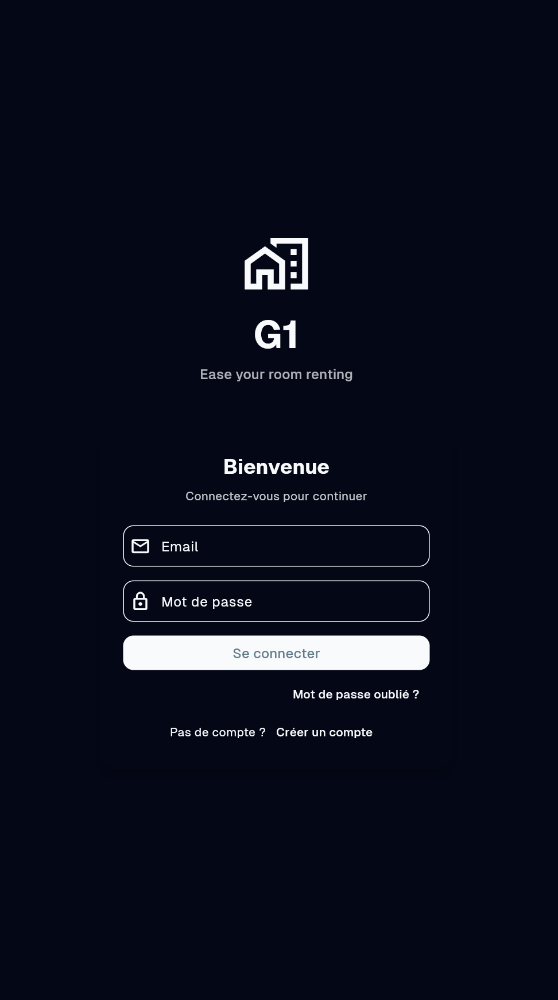
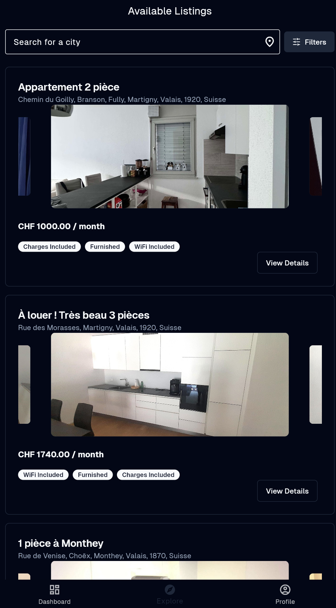
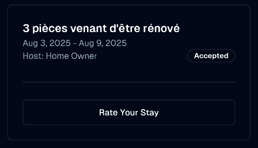
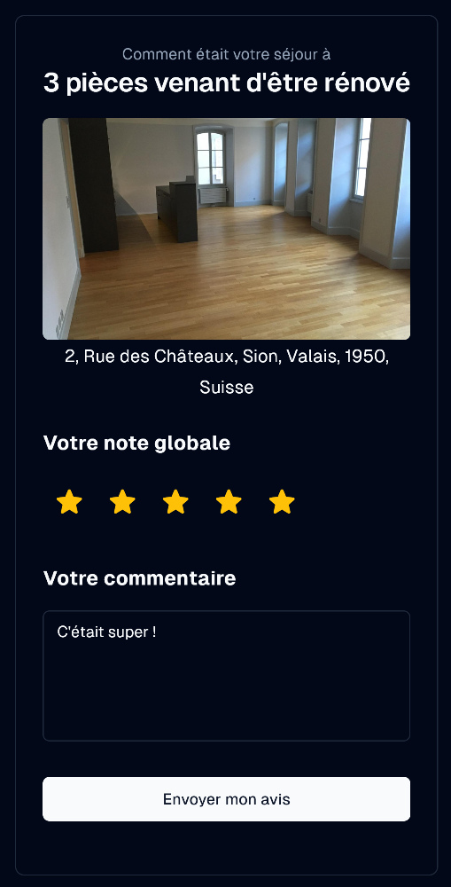
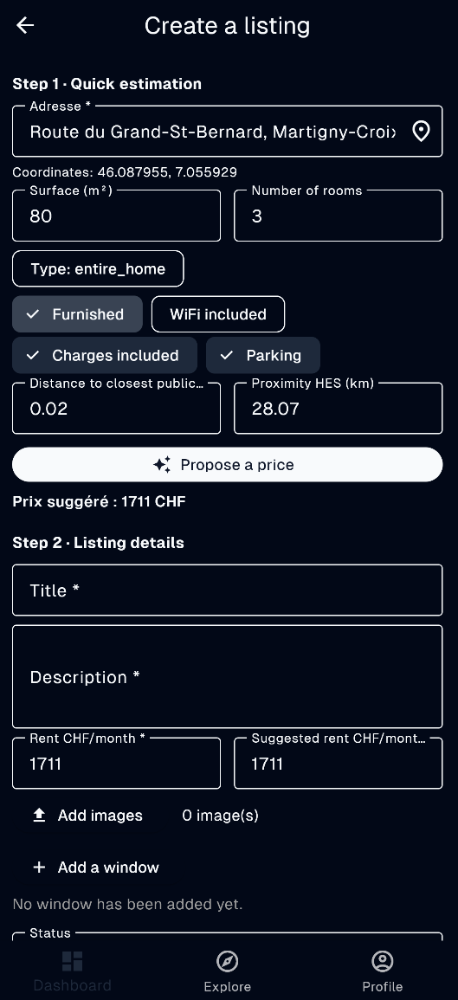
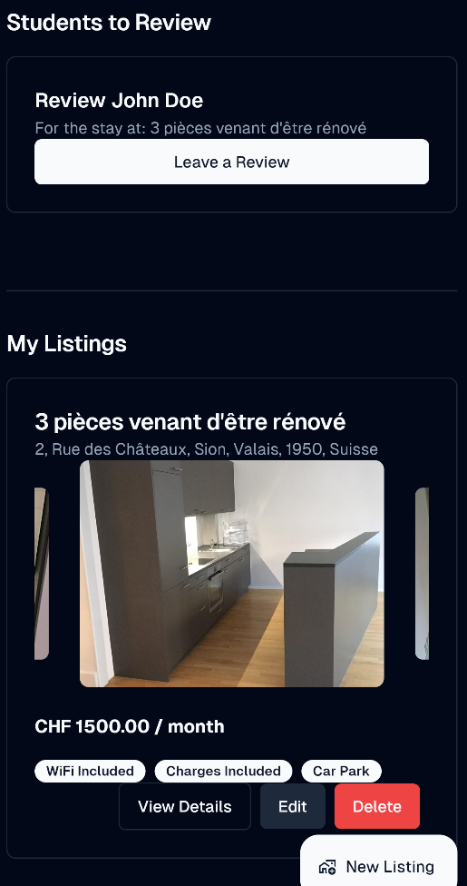
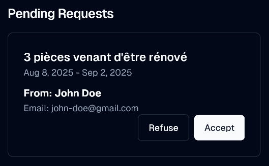
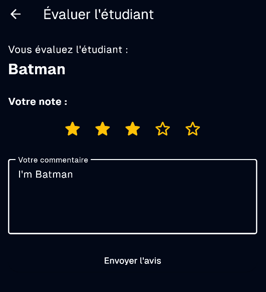
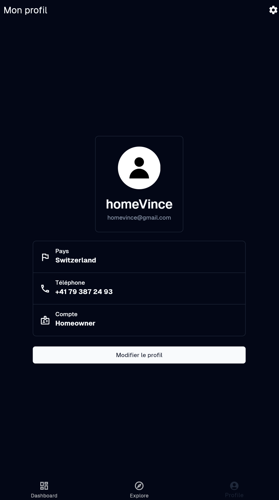

# Room Renting App - User Manual

Welcome to the Room Renting App! This guide will help you navigate the application, whether you are a student looking for a place to stay or a homeowner looking to rent out your space.

## Table of Contents

1. [Getting Started](#1-getting-started)

   * [Creating an Account](#creating-an-account)

   * [Logging In](#logging-in)

2. [For Students](#2-for-students)

   * [Searching for a Room](#2-for-students)

   * [Booking a Room](#booking-a-room)

   * [Viewing Your Bookings](#viewing-your-bookings)

   * [Rating Your Stay](#rating-your-stay)

3. [For Homeowners](#3-for-homeowners)

   * [Creating a Listing](#creating-a-listing)

   * [Managing Your Listings](#managing-your-listings)

   * [Managing Booking Requests](#managing-booking-requests)

   * [Rating a Student](#rating-a-student)

4. [Managing Your Profile](#4-managing-your-profile)

## 1. Getting Started

### Creating an Account

To begin using the app, you'll need to create an account.

1. Open the app and tap on the **"Sign Up"** button.

2. Fill in the required information, which includes your email address, and a secure password. 

3. Then, you will also be asked to specify whether you are a **Student** or a **Homeowner**. You can upload a profile picture.

4. Complete your profile by adding your home address and your HES/University address.

5. Once all fields are complete, tap **"Create Account"**.

### Signing In

If you already have an account, you can log in.

1. Open the app and enter your registered email address and password..

2. Tap the **"Sign in"** button to access your account.

## 2. For Students

As a student, you can search for available rooms, make bookings, and review your stay.

### Searching for a Room

1. From the explore screen, use the search bar to find rooms.

2. You can filter your search by:

   * **Location:** Enter a city.

   * **Price Range:** Set a minimum and maximum price.

   * **Property Type:** Choose between a whole property or a single room.

   * **Amenities:** Select required amenities like Wi-Fi, parking, etc.

   * And others

3. Browse the list of available properties that match your criteria. Tap on a listing to see more details.

### Booking a Room

1. Once you've found a property you like, open its detail page.

2. Here you can view photos, read the description, check the price, and see the predicted price based on market data.

3. You can also view potential public transportation routes to your university.

4. Tap the **"Plan a Booking"** button.

5. Select your desired check-in and check-out dates from the availability calendar.

6. When you press **"Continue"**, your booking request will be sent to the homeowner for approval. You will see in your dashboard once the homeowner responds.

### Viewing Your Bookings

1. Navigate to the **"Dashboard"** section of the app.

2. Here you will see a list of your upcoming, past, and pending booking requests.

### Rating Your Stay

After your stay is complete, you can rate the property and the homeowner.

1. Go to your **"Dashboard"**.

2. Click on the **"Rate Your Stay"** Button for the listing you want to create.

3. Give a star rating and write a short review about your experience.

4. Tap on **"Send my review"**, this will be visible to other users on the listing.

## 3. For Homeowners

As a homeowner, you can list your property, manage bookings, and rate students.

### Creating a Listing

1. Navigate to the **"Dashboard"** section and tap **"New Listing"**.

2. Fill in the property details:

   * Choose an address, then the distances will be calculated automatically.

   * Then enter the surface and number of rooms.

   * Once done, press the **"Predict Price"** button, that will give an estimated price for the listing

   * The second part of the form will appear, letting you enter information about the details

   * The price, images, availability windows (when the listing is available for booking), ...

3. When all information is entered, press **"Save Listing"**

### Managing Your Listings

1. In the **"Dashboard"** section, you can view all the listings you have created.

2. You can edit or delete a listing at any time.

3. Manage your property's information and availability.

### Managing Booking Requests

1. You will receive a notification when a student requests to book your property.

2. Go to the **"Dashboard"** section to see pending requests.

3. Review the student's profile, including their ratings from previous stays.

4. You can then choose to **"Accept"** or **"Refuse"** the booking request. The student will be notified of your decision.

### Rating a Student

After a student has completed their stay, you can rate them.

1. Navigate to your **"Dashboard"**.

2. There will be a **"Rate Student"** button under the students booking.

3. Provide a star rating and a brief comment on your experience with the student.

4. Submit your review. This will be visible for other homeowners reviewing students.

## 4. Managing Your Profile

You can view and update your profile information at any time.

1. Go to the **"Profile"** section of the app.

2. Here you can:

   * Change your profile picture.

   * Update your personal information (name, email, addresses).
   
   * Logout

   * Check out the about page

